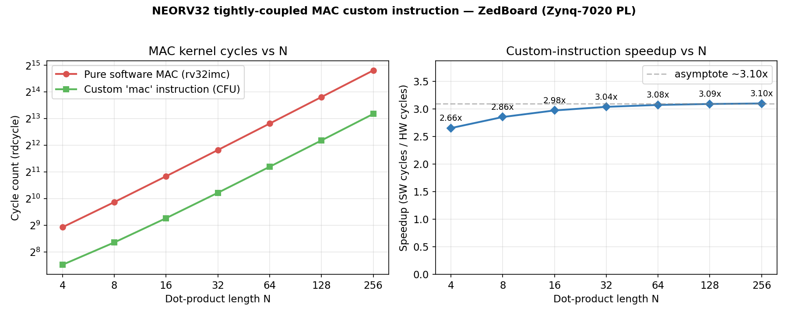

# MAC-Accelerator — A Tightly-Coupled RISC-V MAC Custom Instruction

A **RISC-V ISA extension** on real hardware: a NEORV32 soft-core is instantiated in
the **Zynq-7020 PL** (ZedBoard FPGA fabric), and a custom **`mac`
(multiply-accumulate)** instruction is welded directly into the core's execute stage
through NEORV32's **CFU** (Custom Functions Unit). Operands come from the register
file (`rs1`/`rs2`) and the result returns to `rd` — **not** a memory-mapped / AXI-DMA
accelerator. This is a computer-architecture / HW–SW co-design project; the dot-product
kernel is just a generic compute example.

**Headline result:** the custom instruction computes a Q8.8 dot-product **~3.1× faster**
(in cycle count) than the pure-software loop on the same core, while timing closes
comfortably (**WNS +1.095 ns**) and it costs **~1 % of the DSPs**.



---

## Result summary

Measured on hardware (ZedBoard, NEORV32 in PL @100 MHz) via the `rdcycle`/`MCYCLE` CSR:

| N (length) | SW cycles | HW cycles | Speedup | Correct |
|-----------:|----------:|----------:|--------:|:-------:|
| 4   | 486    | 183   | 2.66× | ✅ |
| 8   | 934    | 327   | 2.86× | ✅ |
| 16  | 1830   | 615   | 2.98× | ✅ |
| 32  | 3622   | 1191  | 3.04× | ✅ |
| 64  | 7206   | 2343  | 3.08× | ✅ |
| 128 | 14374  | 4647  | 3.09× | ✅ |
| 256 | 28710  | 9255  | 3.10× | ✅ |

SW ≈ 112 cyc/element, HW ≈ 36 cyc/element. Speedup rises with N (fixed call overhead
amortizes) and approaches a **~3.1× asymptote**. All N produce bit-identical SW and HW
results (48-bit accumulator, cross-checked with an `int64` reference).

**Implementation (post-route):** WNS **+1.095 ns** (timing closed, single-cycle MAC — no
multi-cycle fallback needed). Utilization on xc7z020: **DSP ≈ 1 %**, LUT ≈ 4 %, FF ≈ 2 %,
BRAM ≈ 6 %. The 16×16 multiply maps to a single DSP48E1. (Full reports in `reports/`
after `build_bitstream.tcl`.)

Raw data + plot: `results/` (`benchmark_raw.txt`, `cycles.csv`, `speedup.png`).

---

## The custom instruction

CUSTOM-0 opcode, R-type, selected by `funct3` (see `rtl/neorv32_cpu_alu_cfu.vhd`):

| Mnemonic   | funct3 | Semantics |
|------------|:------:|-----------|
| `mac`      | 000    | `acc += signed(rs1[15:0]) * signed(rs2[15:0])`; `rd = acc[31:0]` |
| `mac.rdlo` | 001    | `rd = acc[31:0]` (accumulator unchanged) |
| `mac.rdhi` | 010    | `rd = sign_ext(acc[47:32])` |
| `mac.clr`  | 011    | `acc <= 0`; `rd = 0` |

Operands are **Q8.8** signed fixed-point in the low 16 bits of `rs1`/`rs2`; the product
is Q16.16, accumulated into a hidden **48-bit accumulator** (the DSP48E1 P-register
width). The accumulator lives **inside the CFU** — no register-file 3rd-read-port hack.
From C, the instruction is emitted with NEORV32's `RISCV_INSTR_R_TYPE` intrinsic
(`.insn`), so no compiler/assembler patching is required:

```c
#define mac_acc(a,b) RISCV_INSTR_R_TYPE(RISCV_OPCODE_CUSTOM0, 0b000, 0b0000000, (a), (b))
#define mac_clr()    RISCV_INSTR_R_TYPE(RISCV_OPCODE_CUSTOM0, 0b011, 0b0000000, 0, 0)
#define mac_rdlo()   RISCV_INSTR_R_TYPE(RISCV_OPCODE_CUSTOM0, 0b001, 0b0000000, 0, 0)
#define mac_rdhi()   RISCV_INSTR_R_TYPE(RISCV_OPCODE_CUSTOM0, 0b010, 0b0000000, 0, 0)
```

**Cycle model:** single-cycle (`valid_o <= start`, combinational multiply+add, registered
accumulate). Timing closed, so the documented multi-cycle fallback (DSP MREG/PREG +
done-strobe) was not needed.

---

## How it runs (the test rig)

The ZedBoard's onboard USB-UART is wired to the **PS**, not the PL, so the PL soft-core's
UART is reached through an **ESP32-C6 acting as a transparent UART bridge**:

```
   PC (PuTTY / upload.py)            ESP32-C6 (bridge)              ZedBoard PL
  ┌────────────────────┐  USB/CH343 ┌────────────────┐  3.3V UART ┌──────────────────────┐
  │ COM7 @ 19200-8N1   │◄──────────►│ UART0  ◄────►  │            │ NEORV32 core         │
  │                    │            │ UART1  ◄───────┼───PMOD JA──┤ UART0  + CFU('mac')  │
  └────────────────────┘            │ WS2812 = traffic│           │ (Zynq-7020 fabric)   │
                                     └────────────────┘            └──────────────────────┘
```

The ESP32-C6 firmware is a dumb byte-pump (`esp32c6_bridge/`); its onboard RGB LED
smoothly shifts hue on every byte as a liveness indicator. See
`esp32c6_bridge/README.md`. (A scrapped WiFi/TCP variant lives in git history.)

---

## Repository layout

```
rtl/
  neorv32_zedboard_top.vhd   top wrapping neorv32_top, RISCV_ISA_Xcfu => true
  mac_datapath.vhd           signed 16x16 Q8.8 MAC, 48-bit acc (reused HFT DSP primitive)
  neorv32_cpu_alu_cfu.vhd    OVERRIDE of the upstream CFU (XTEA replaced by MAC)
sim/
  mac_datapath_tb.vhd        self-checking datapath TB (golden model)
  mac_cfu_tb.vhd             self-checking CFU TB (mac/rdlo/rdhi/clr/illegal)
constraints/ zedboard_mac.xdc  clk Y9, BTNC reset, UART on PMOD JA, LEDs
scripts/
  add_sources.tcl            populate the Vivado project (run first)
  run_sim.tcl                run a TB in xsim
  build_bitstream.tcl        synth+impl+bitstream + timing/utilization reports
sw/mac_demo/ main.c, makefile  bare-metal SW-vs-HW benchmark sweep
esp32c6_bridge/              ESP-IDF UART bridge firmware + upload.py
results/  benchmark_raw.txt, cycles.csv, speedup.png, plot_results.py
```

The NEORV32 core is a **sibling clone** at `D:/vivado projects/neorv32`
(`git clone https://github.com/stnolting/neorv32`), referenced by absolute path — not
vendored into this repo.

---

## Reproduce

### 1. Hardware: build the bitstream (Vivado 2025.2)
```tcl
vivado -mode batch -source scripts/add_sources.tcl
vivado -mode batch -source scripts/build_bitstream.tcl
```
`add_sources.tcl` adds all `neorv32/rtl/core/*.vhd` into library `neorv32` **except** the
upstream CFU, substituting `rtl/neorv32_cpu_alu_cfu.vhd` (the MAC). Top =
`neorv32_zedboard_top`. Program the `.bit` via Hardware Manager.

Optional sim gates (no board):
```tcl
vivado -mode batch -source scripts/run_sim.tcl -tclargs mac_datapath_tb
vivado -mode batch -source scripts/run_sim.tcl -tclargs mac_cfu_tb
```

### 2. ESP32-C6 bridge (ESP-IDF v6)
```powershell
. C:\esp\v6.0.1\esp-idf\export.ps1
cd esp32c6_bridge
idf.py set-target esp32c6
idf.py -p COM7 flash
```
Wire (3.3 V only; power the ESP from USB, not the board): PMOD **JA1→GPIO4**,
**JA2→GPIO5**, **GND↔GND**.

### 3. Software: build `neorv32_exe.bin`
No standalone RISC-V toolchain is required — reuse ESP-IDF's `riscv32-esp-elf-gcc` plus
MSYS2's `make`/host `gcc`. Spaces in paths break the NEORV32 makefile, so junctions are
used (`C:\nv32` → the neorv32 clone, `C:\macacc` → this project). Build from PowerShell
(its `%TEMP%` is writable):
```powershell
$env:PATH = "C:\msys64\usr\bin;C:\msys64\ucrt64\bin;" +
            "C:\Users\ozkan\.espressif\tools\riscv32-esp-elf\esp-15.2.0_20251204\riscv32-esp-elf\bin;" + $env:PATH
$env:TMP = "C:\msys64\tmp"; $env:TEMP = "C:\msys64\tmp"
cd C:\macacc\sw\mac_demo
make NEORV32_HOME=/c/nv32 RISCV_PREFIX=riscv32-esp-elf- clean_all exe
```

### 4. Upload + run, then plot
Press **BTNC (center)** to reset the FPGA into the bootloader, then:
```powershell
cd C:\macacc\esp32c6_bridge
python upload.py --port COM7 --file C:\macacc\sw\mac_demo\neorv32_exe.bin --log ..\results\benchmark_raw.txt
cd C:\macacc\results
python plot_results.py --log benchmark_raw.txt --out .
```
(A finished program leaves the CPU off the bootloader prompt, so press BTNC again before
each re-upload.)

---

## Success criteria

- [x] Part fixed to `xc7z020clg484-1`; project synthesizes for ZedBoard.
- [x] NEORV32 runs in the PL; bare-metal code prints over UART.
- [x] `mac` custom instruction functionally correct (CFU TB + SW cross-check, all N).
- [x] Timing closes — WNS **+1.095 ns**, custom instruction off the critical path.
- [x] Speedup measured: pure-SW vs custom-instruction, **2.66×→3.10×** (rdcycle).
- [x] Resource report: DSP ≈ 1 %, LUT ≈ 4 %, FF ≈ 2 % (single DSP48E1 for the MAC).
